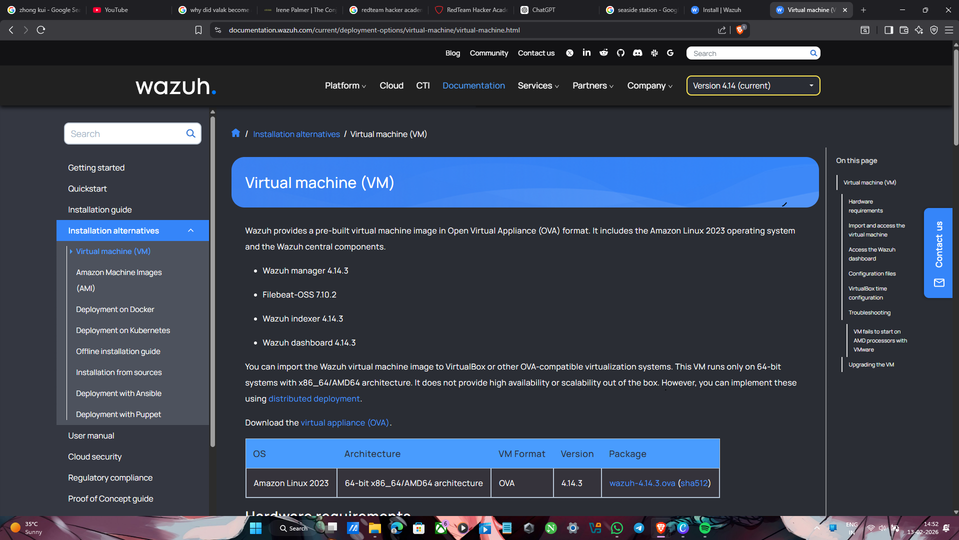
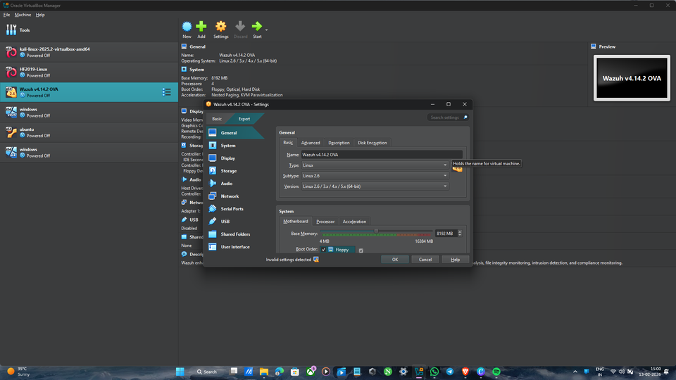
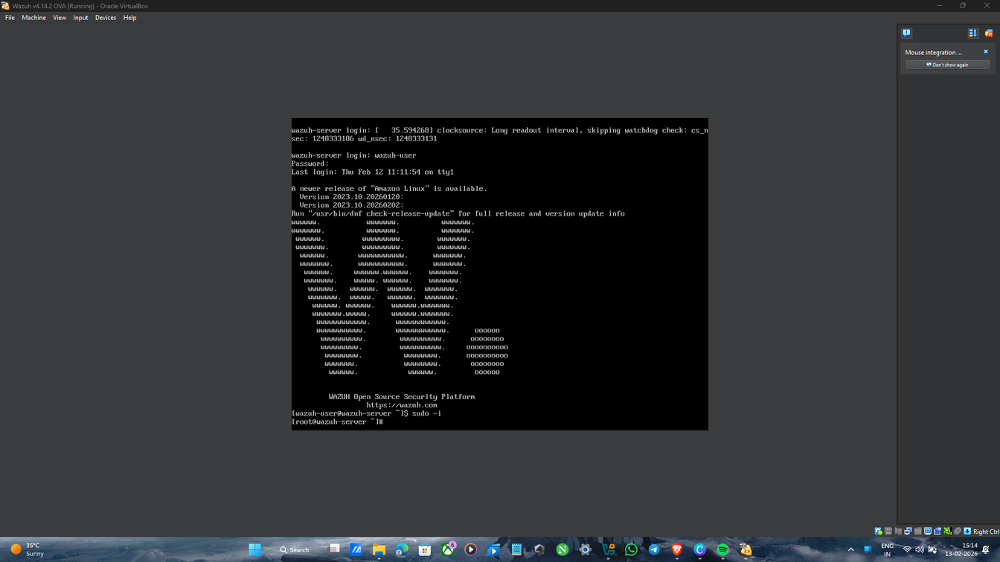
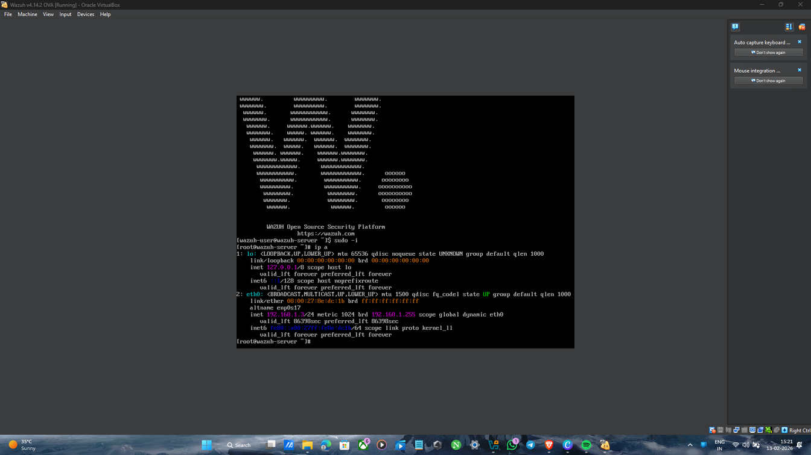
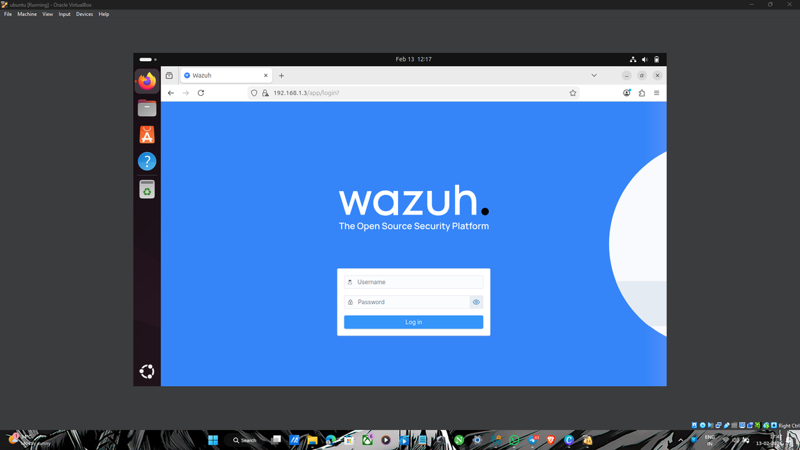

# Wazuh SIEM Deployment and Security Monitoring Project

## 🚀 Project Overview
This project demonstrates the deployment of **Wazuh SIEM** using a pre-built Virtual Appliance (OVA) on Oracle VirtualBox, setting up an endpoint agent on Ubuntu, and simulating security threats (such as brute-force attacks via Hydra from Kali Linux) to trigger and analyze real-time security alerts.

---

## 🛠️ Environment Architecture
* **SIEM Server:** Wazuh v4.14.2 (Amazon Linux 2003 OVA running on Oracle VirtualBox)
* **Monitored Endpoint:** Ubuntu 24.04 LTS (Wazuh Agent installed)
* **Attacker / Testing Machine:** Kali Linux (Used for security testing and threat simulation)

---

## 📋 Step-by-Step Implementation Guide

### 1. Wazuh Server Setup
* Downloaded the Wazuh OVA image from the official documentation (`1.png`).
* Imported and configured the virtual machine settings within **Oracle VirtualBox** (`2.png`).
* Booted up the server, logged in with default credentials (`wazuh-user`), and retrieved the server IP address via `ip a` (`3.png`, `4.png`).

### 2. Accessing the Dashboard & Deploying Agents
* Accessed the Wazuh web dashboard via browser (`5.png`).
* Generated agent deployment configurations for the Ubuntu endpoint (`6_2.png`).
* Executed the installation script on the Ubuntu machine and started the `wazuh-agent` service (`7.jpg`).
* Verified active agents and system inventories on the dashboard (`8_2.png`, `9_2.png`).

### 3. Threat Detection & Security Monitoring
* Simulated login attacks and brute-force attempts from Kali Linux.
* Monitored security events, logs, and rule alerts in real time on the Wazuh Threat Hunting dashboard (`10.jpg`).

---

## 📸 Implementation Screenshots

| Step | Description | Screenshot Preview |
| :--- | :--- | :--- |
| **1** | Wazuh OVA Documentation |  |
| **2** | VirtualBox VM Configuration |  |
| **3** | Server Shell Login |  |
| **4** | Server IP Configuration (`ip a`) |  |
| **5** | Wazuh Web Dashboard Login |  |
| **6** | Agent Deployment Settings |  |
| **7** | Ubuntu Agent Terminal Setup |  |
| **8** | Agent Dashboard Overview |  |
| **9** | Active Agents Summary |  |
| **10**| Threat Hunting & Attack Logs |  |
